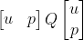
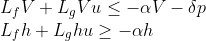
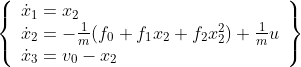
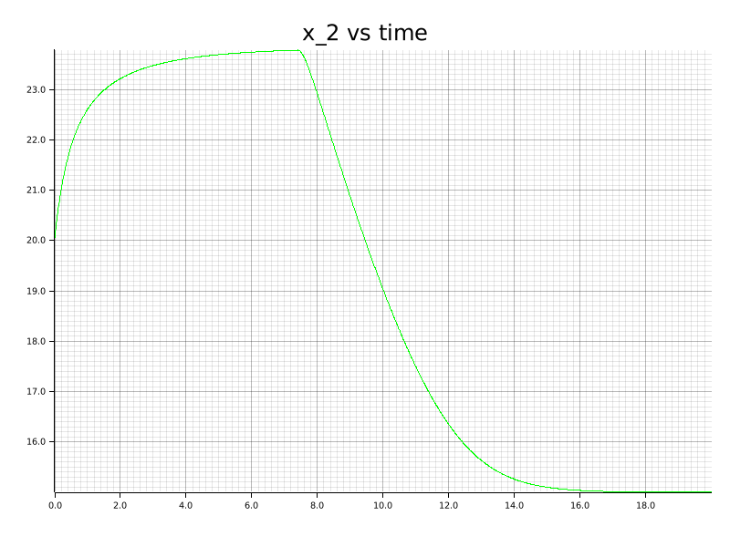
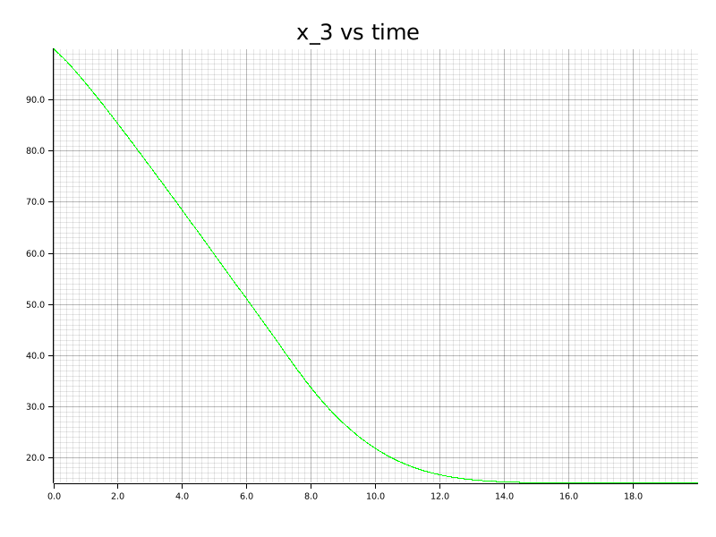
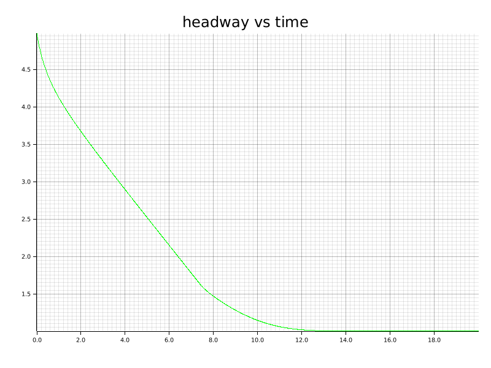
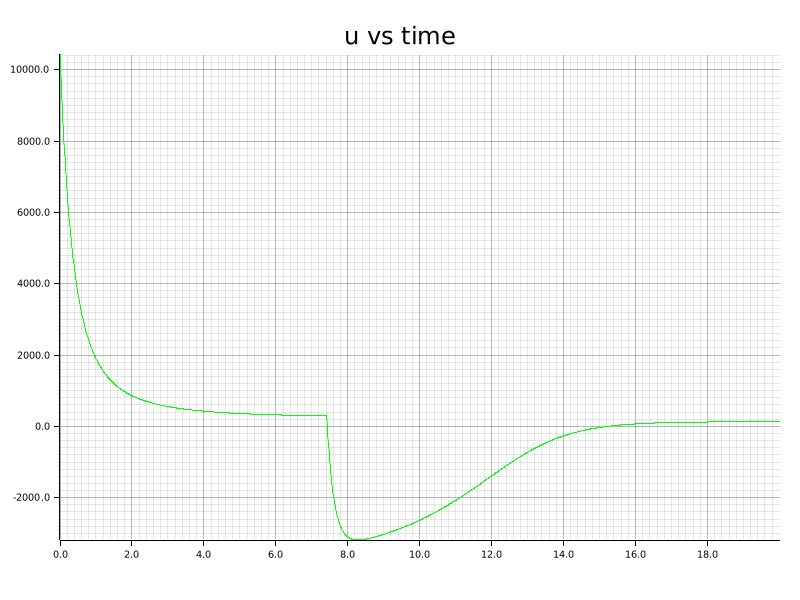

# CLF-CBF Controller
Dynamical system:

$\dot{x} = f(x) + g(x)u, f(\cdot): \mathbb{R}^{n} \rightarrow \mathbb{R}^{n}, g(\cdot): \mathbb{R}^{n} \rightarrow \mathbb{R}^{n}, u \in \mathbb{R}$

## Controller
Controller minimize:

such that:

## Examples

### ACC

Velociy of host vehicle:

Distance between host and leading vehicle:

Headway time:

Control signal:

